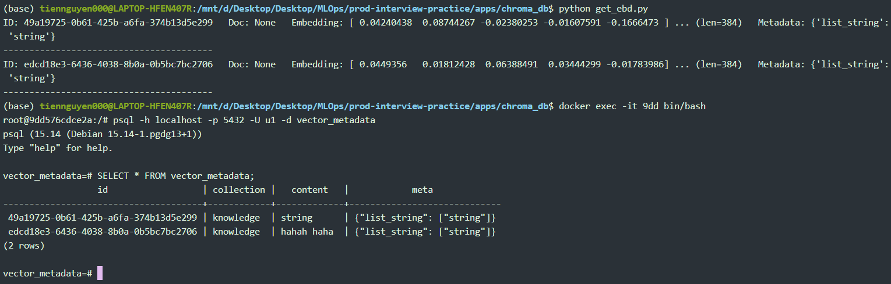

```shell
cd apps/chroma_db
```
```shell
pip install -r requiremets.txt
```
# Set up Posgres
```shell
docker run --name chroma_postgres   -e POSTGRES_USER=k1   -e POSTGRES_PASSWORD=k1   -e POSTGRES_DB=k1   -p 5435:5432   -d postgres:15
```
### Note: docker ps -a to check avoid same port. if re map, adjust in config postgres
## create table: 
```shell
python ids/postges/postgres.py
```
# Set up Chroma
## 1. create container (server)
```shell
docker run -d -p 8000:8000 ghcr.io/chroma-core/chroma:latest
```
###    Note: same setup postgres
# API
```shell
python test.py
```
### http://localhost:8008/docs#
## Test (open new tab)
### test vector db
```shell
python get_ebd.py
```
### test ids, doc, metadata
```shell
docker exec -it <id container postgre> bin/bash
```
